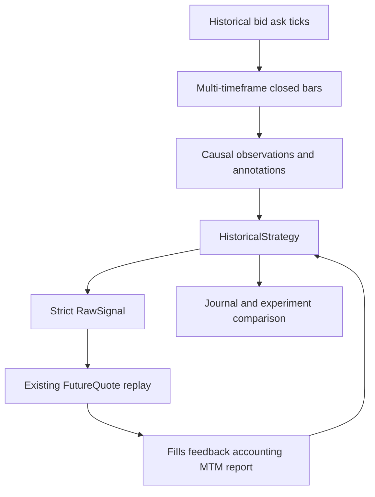
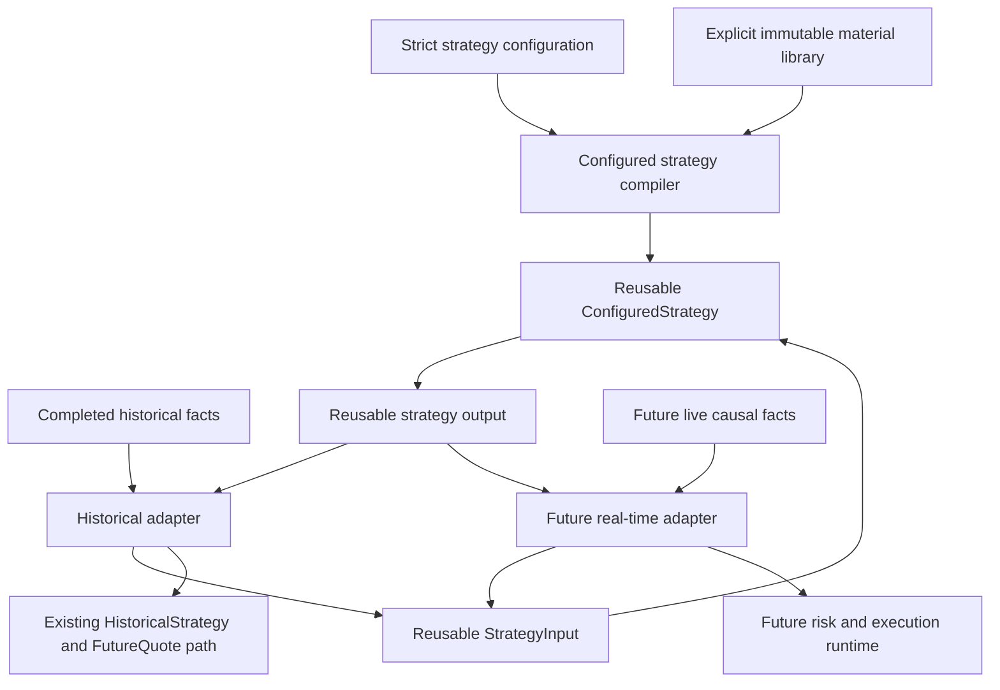

# Roadmap

The implemented foundation supports reusable historical strategy research and backtesting over the existing FutureQuote execution and accounting path, plus a reusable synchronous configured strategy core. The intended next direction is a historical adapter that connects configured behavior to that replay path.

> This roadmap does not schedule a live trading platform. It keeps reusable strategy behavior independent from historical replay so a future real-time adapter would not require duplicating strategy logic.

## Current foundation

The historical strategy foundation currently provides validated descriptors and requirements, bounded causal fixed-duration closed bars, complete-boundary analysis, stateful callbacks, generated-signal scheduling, committed execution feedback, bounded decisions, non-economic journals, research-only annotations, and caller-ordered comparison of existing position-level metrics.

Current callers implement `HistoricalStrategy` directly in Rust. A generated fill-bearing action cannot execute on a quote already observed to make that decision.

## Configured strategy direction

The dependency-light synchronous `qs-strategy` core now implements reusable configured behavior outside `qs-backtest`. Its purpose is to avoid requiring a dedicated Rust strategy type for every strategy that can be assembled from reusable materials. Historical backtesting remains a future adapter to that core rather than the owner of the configuration compiler, materials, expressions, or state machine.

The intended flow is:

The configured core now provides:

- recursively strict configuration without a schema-version field;
- an explicit immutable library of reusable causal materials;
- compile-time source, named-input schema, reference, type, dependency, per-source lookback, trigger, state, expression, and bound validation;
- bounded typed condition expressions rather than free-form strings;
- ordered independent logical-source updates, total vacant/pending/open trade-slot facts, and deterministic finite-state transitions with atomic state and output;
- typed strict `RawSignal` action templates carried by commands with deterministic correlation IDs, validated action-specific feedback lifecycles, plus generic decision and note templates;
- one reusable configured strategy core independent from historical and real-time runtime ownership;
- neutral conformance coverage and a custom material extension seam;
- no content hash, digest, fingerprint, or content-derived strategy identity.

The historical adapter that binds logical sources to historical series and reuses the existing callback and FutureQuote execution path is not implemented. It must preserve command IDs through effect-before-disposition feedback, map generic notes into historical journals, and prove direct-signal and feed parity without duplicating economics. Server or RPC execution, live runtime orchestration, configured-state persistence, and configured-strategy composition with management profiles also remain unavailable.

Direct Rust strategies will remain supported for custom algorithms that do not fit the configured model. The framework will not claim that every possible strategy can or should be represented as configuration. No real-time adapter or live execution runtime is part of the current implementation goal.

## Design constraints

Configured strategy execution must preserve the current causal order:

1. settle existing FutureQuote work and commit feedback;
2. update completed historical series and causal analysis;
3. project one immutable reusable strategy input from completed facts;
4. evaluate reusable materials in stable dependency order and select at most one configured transition;
5. atomically commit configured state and output;
6. return ordered correlated commands containing strict `RawSignal` payloads plus generic decisions and notes to the historical adapter;
7. wait for a later eligible quote for fill-bearing work.

Emitting an Entry is not equivalent to a fill. Configured state must use committed execution feedback to distinguish requested, open, rejected, and closed lifecycle states.

Before adapter readiness, causal materials advance but configured transitions, state assignments, decisions, notes, and signals do not. The first ready input evaluates the accumulated material state from unchanged configured state. EMA and ATR update only from new completed bars, crossing is a one-boundary pulse, and command feedback retains its originating correlation ID. Initial execution is limited to one configured instance, one primary symbol, and one active campaign. Missing arithmetic remains missing, comparisons with missing are false, required output cannot be missing, and every declared configured state must be reachable from the initial state or compilation fails.

## What will be reused

The historical adapter will reuse:

- historical feed and complete timestamp-batch abstractions;
- `HistoricalStrategy`, `StrategyContext`, and `StrategyFeedback`;
- causal series, observations, annotations, and analyzers;
- strict `RawSignal` validation;
- replay instrument specifications;
- unprofiled Entry resolution for the initial configured path;
- FutureQuote slippage, pending, stop, target, scale-in, and close behavior;
- account-currency sizing and conversion;
- fills, lifecycle, MTM, drawdown, and `BacktestResult`;
- decision, journal, research annotation, and experiment output.

## Neutral acceptance direction

Public conformance should use neutral examples such as:

- a no-op configured strategy;
- a moving-average crossover configuration;
- a volatility-aware lifecycle configuration;
- feedback-driven entry, break-even, partial-close, and exit behavior;
- one custom material reused by more than one configuration;
- economic parity with equivalent direct `RawSignal` replay.

Concrete private strategy configurations may be added later when there is a real research need. They are not required to introduce named strategy types into the reusable framework.

## What is not on the active roadmap

- dedicated named strategy implementations as a framework requirement;
- a universal or free-form scripting language;
- global mutable component registries;
- dynamic plugins or behavior discovery;
- deployment compilers or content-addressed strategy artifacts;
- strategy configuration over RPC;
- ingestion-to-trading bridges;
- multi-strategy portfolio allocation;
- paper or live execution gateways;
- restart-safe configured or live strategy state;
- broker and exchange order adapters;
- cryptocurrency economics beyond the current rejection guard;
- model training and live inference;
- Discord or screenshot integrations.

An explicit immutable run-local material library and an in-process configured-strategy compiler are compatible with these boundaries. They must not grow into a global plugin or deployment platform.

## Completion target

The configured-strategy objective is complete when a developer can:

1. define a nontrivial causal strategy through strict configuration and reusable materials;
2. compile it in a reusable strategy core outside `qs-backtest` and reject invalid graphs, types, references, bounds, and transitions before execution;
3. consume adapter-supplied causal context and committed execution feedback without importing historical runtime types;
4. emit validated ordered commands with deterministic correlation IDs, strict `RawSignal` payloads, and bounded generic decisions and notes;
5. adapt the same configured behavior to historical replay through the existing FutureQuote engine without another economic path;
6. reproduce equivalent direct-signal economic results;
7. reuse one custom material across several configurations;
8. preserve a boundary that a future real-time adapter can use without depending on `qs-backtest`;
9. continue implementing direct Rust strategies without framework regression.

See [Backtesting](backtesting.md) for current replay behavior and limitations.
