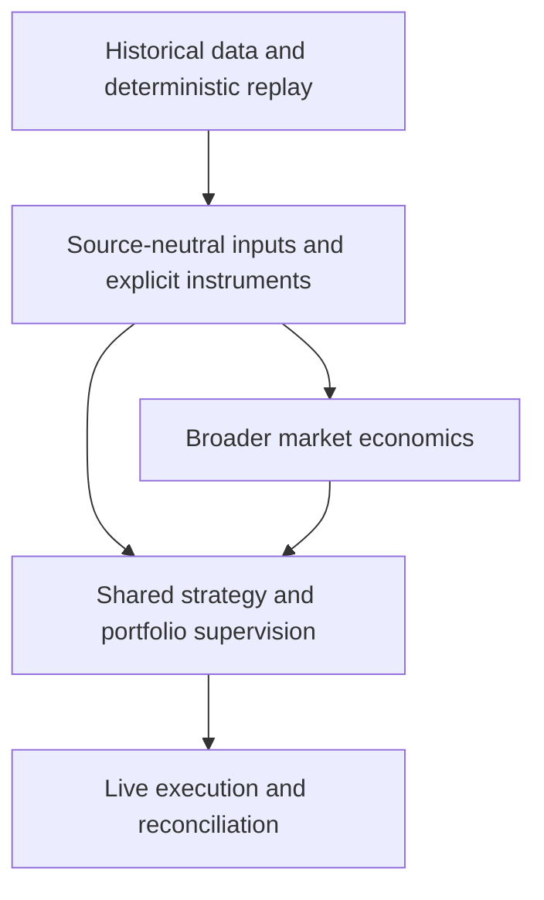

# Roadmap

`quant-system` is growing from deterministic historical replay and live quote distribution into a source-neutral strategy, risk, and execution framework.

> This roadmap describes direction, not a delivery schedule. An item is available only when it has a public API, command, or documented workflow.

## At a glance

| Today | Next focus | Later |
|---|---|---|
| Deterministic replay, reusable Rust libraries, durable ingestion state, Telegram batch and relay adapter APIs, and CTrader live quotes | Neutral runners, a full deployment manifest, additional source providers, explicit instruments, and shared risk supervision | Live execution, venue-state recovery, and broader market economics |

## Direction

See [Choose a workflow](../README.md#choose-a-workflow) for available entry points and [Architecture](architecture.md) for ownership boundaries.

## What we are building toward

### Accept signals from more sources

Reusable source-event, normalization, provenance, and durable source-state boundaries are available as library APIs while direct strict `RawSignal` input remains supported. The public Telegram adapter library now separates batch and relay adaptation, preserves exact opaque Telegram identity with strict bounded evidence and stable delivery identities, and exposes an existing-`ChannelParser` compatibility producer through shared validation and durable context snapshots. The next step is to compose neutral offline, online, and replay runners around a full deployment manifest, add source providers, and host publication workers.

**What this unlocks:** additional message sources and explicit handling of edits, deletes, retries, and duplicate delivery.

### Represent instruments and trading intent explicitly

Distinguish data-source symbols, economic instruments, and execution venues. Introduce shared intent and execution-result facts without silently changing the current replay input contract.

**What this unlocks:** safer multi-venue identity, economic capability checks, and a common boundary for parser and strategy outputs.

### Run strategies through shared risk supervision

Connect parsed signals and strategy decisions to common portfolio risk, allocation, and execution planning without treating them as the same kind of producer.

**What this unlocks:** portfolio-level guardrails and comparable replay and live behavior independent of source or strategy implementation.

### Connect supervised intent to live venues

Add venue capability checks, execution reports, restart-safe state, uncertain-outcome reconciliation, and provider-specific order adapters behind a venue-neutral boundary.

**What this unlocks:** live order execution without embedding broker behavior in domain, parser, or strategy code.

## Parallel exploration

### Broader market economics

Add explicit cryptocurrency models for exposure, balances, fees, market data, funding, margin, liquidation, and venue behavior without reusing Forex assumptions.

### Advanced strategy components

Explore richer analysis and model-driven strategy components after neutral strategy, risk, replay, and market-event boundaries are established.

## Not available yet

Live execution, neutral hosted ingestion runners, a full deployment manifest, additional source providers, publication workers, committed-batch trading projection, and general cryptocurrency accounting are not available yet. Existing `OfflineRunner`, `OnlineServer`, callback, and JSONL compatibility facades remain unchanged and are not hosted through durable state. See the root [current boundaries](../README.md#current-boundaries) for complete operational limitations.
