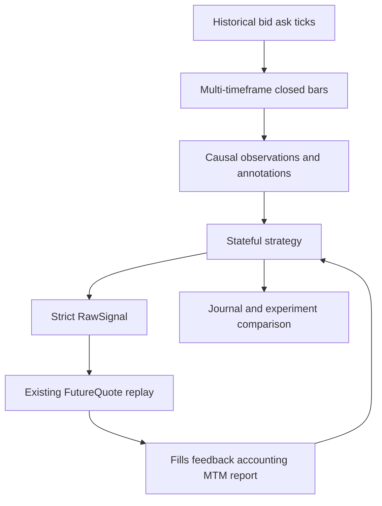

# Roadmap

The current development goal is historical strategy research and backtesting. The framework will support nontrivial multi-timeframe strategies while continuing to use the existing FutureQuote execution and accounting path.

> This roadmap describes active work only. It does not assume a later live trading platform.

## Current focus

## Strategy capabilities

The historical strategy runtime will provide:

- explicit strategy requirements and typed caller-owned configuration;
- D1, H4, H1, M15, and M5 closed bars derived causally from historical data;
- bid/ask ticks for execution;
- warmup;
- common price observations such as zones, swings, rejection, and momentum;
- custom strategy-owned indicators without a plugin registry;
- stateful setup, confirmation, entry, management, and exit;
- FutureQuote fill, rejection, reduction, scale-in, protection, and close feedback;
- direct strict `RawSignal` output;
- journal records, causal annotations, hindsight-only labels, ghost decisions, and deterministic baselines.

A strategy-generated fill-bearing action cannot execute on a quote already observed to make that decision.

## Concrete acceptance

The runtime will be tested against:

- an easy higher-timeframe support/resistance strategy with a 1:1 target;
- a lower-timeframe confirmation strategy with early loser exits, break-even, and add-to-winner behavior;
- a separate asymmetric partial-close and runner experiment;
- a deterministic random-entry baseline;
- an unrelated moving-average strategy;
- a strategy with a custom internal indicator that requires no framework schema change.

This provides enough structure for real strategies without making support/resistance or one trader's terminology mandatory in core.

## Existing code simplification

The unused canonical intent, command/dispatch, and venue-report scaffolding has been removed. Strict RawSignal, instrument-domain contracts, FutureQuote, sizing, currency conversion, accounting, and reports remain the active foundation.

The original committed-batch execution bridge will not be reintroduced. A separate reduced ingestion tool may export an active committed-signal snapshot as ordinary RawSignal JSONL for the existing `tg_backtest` workflow; it is not part of Strategy execution.

## What will be reused

- historical feed abstractions;
- strict RawSignal validation;
- replay instrument specifications;
- ManagementProfile;
- FutureQuote latency, slippage, pending, stop, target, scale-in, and close behavior;
- account-currency sizing and conversion;
- fills, lifecycle, MTM, drawdown, and BacktestResult.

## What is not on the active roadmap

- global component registries;
- deployment compilers;
- content-addressed strategy artifacts;
- ingestion-to-trading bridges;
- multi-strategy portfolio allocation;
- paper or live execution gateways;
- restart-safe live strategy runtimes;
- broker and exchange order adapters;
- cryptocurrency economics beyond the current rejection guard;
- model training and live inference;
- strategy RPC services;
- Discord or screenshot integrations.

## Completion target

The roadmap is complete when a developer can:

1. describe required historical series and warmup;
2. consume causal multi-timeframe context and manual annotations;
3. run one stateful strategy through setup and position management;
4. execute generated signals through the existing FutureQuote engine;
5. react to committed execution feedback;
6. inspect decisions, generated signals, fills, lifecycle, PnL, MTM, drawdown, and research journal records;
7. compare explicit strategy variants without hindsight leakage;
8. implement an unrelated strategy without changing framework contracts.

See [Backtesting](backtesting.md) for current replay behavior and limitations.
