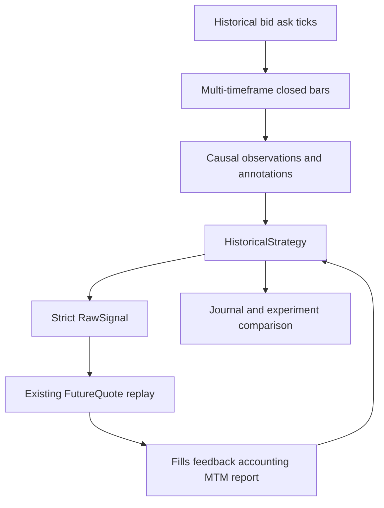
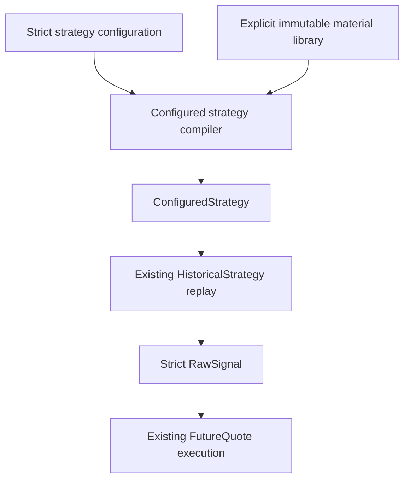

# Roadmap

The current development goal is reusable historical strategy research and backtesting over the existing FutureQuote execution and accounting path.

> This roadmap describes intended direction. It does not assume a later live trading platform.

## Current foundation

The historical strategy foundation currently provides validated descriptors and requirements, bounded causal fixed-duration closed bars, complete-boundary analysis, stateful callbacks, generated-signal scheduling, committed execution feedback, bounded decisions, non-economic journals, research-only annotations, and caller-ordered comparison of existing position-level metrics.

Current callers implement `HistoricalStrategy` directly in Rust. A generated fill-bearing action cannot execute on a quote already observed to make that decision.

## Configured strategy direction

A future configured-strategy path is under design but is not implemented yet. Its purpose is to avoid requiring a dedicated Rust strategy type for every strategy that can be assembled from reusable materials.

The intended flow is:

The configured path is expected to provide:

- a strict versioned configuration schema;
- reusable versioned causal materials;
- compile-time reference, type, dependency, lookback, warmup, and bound validation;
- bounded typed condition expressions rather than free-form strings;
- deterministic finite-state transitions;
- typed `RawSignal` action templates and journal templates;
- one reusable configured strategy implementation over the existing callback;
- neutral conformance examples and a custom material extension seam.

Direct Rust strategies will remain supported for custom algorithms that do not fit the configured model. The framework will not claim that every possible strategy can or should be represented as configuration.

## Design constraints

Configured strategy execution must preserve the current causal order:

1. settle existing FutureQuote work and commit feedback;
2. update completed historical series;
3. evaluate causal materials and analysis in stable order;
4. evaluate at most one configured transition from one immutable boundary snapshot;
5. atomically commit configured state and output;
6. lower actions to strict `RawSignal`;
7. wait for a later eligible quote for fill-bearing work.

Emitting an Entry is not equivalent to a fill. Configured state must use committed execution feedback to distinguish requested, open, rejected, and closed lifecycle states.

## What will be reused

- historical feed and complete timestamp-batch abstractions;
- `HistoricalStrategy`, `StrategyContext`, and `StrategyFeedback`;
- causal series, observations, annotations, and analyzers;
- strict `RawSignal` validation;
- replay instrument specifications;
- `ManagementProfile`;
- FutureQuote slippage, pending, stop, target, scale-in, and close behavior;
- account-currency sizing and conversion;
- fills, lifecycle, MTM, drawdown, and `BacktestResult`;
- decision, journal, research annotation, and experiment output.

## Neutral acceptance direction

Public conformance should use neutral examples such as:

- a no-op configured strategy;
- a moving-average crossover configuration;
- a volatility-aware lifecycle configuration;
- feedback-driven entry, break-even, partial-close, and exit behavior;
- one custom material reused by more than one configuration;
- economic parity with equivalent direct `RawSignal` replay.

Concrete private strategy configurations may be added later when there is a real research need. They are not required to introduce named strategy types into the reusable framework.

## What is not on the active roadmap

- dedicated named strategy implementations as a framework requirement;
- a universal or free-form scripting language;
- global mutable component registries;
- dynamic plugins or behavior discovery;
- deployment compilers or content-addressed strategy artifacts;
- strategy configuration over RPC;
- ingestion-to-trading bridges;
- multi-strategy portfolio allocation;
- paper or live execution gateways;
- restart-safe configured or live strategy state;
- broker and exchange order adapters;
- cryptocurrency economics beyond the current rejection guard;
- model training and live inference;
- Discord or screenshot integrations.

An explicit immutable run-local material library and an in-process configured-strategy compiler are compatible with these boundaries. They must not grow into a global plugin or deployment platform.

## Completion target

The configured-strategy objective is complete when a developer can:

1. define a nontrivial causal strategy through strict configuration and reusable materials;
2. compile and reject invalid graphs, types, references, bounds, and transitions before replay;
3. consume causal multi-timeframe context and committed execution feedback;
4. emit validated ordered `RawSignal` actions and bounded journals;
5. execute through the existing FutureQuote engine without another economic path;
6. reproduce equivalent direct-signal economic results;
7. reuse one custom material across several configurations;
8. continue implementing direct Rust strategies without framework regression.

See [Backtesting](backtesting.md) for current replay behavior and limitations.
