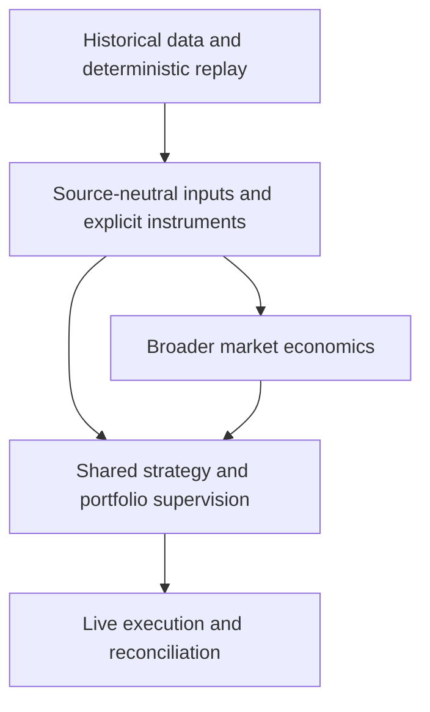

# Roadmap

`quant-system` is growing from deterministic historical replay and live quote distribution into a source-neutral strategy, risk, and execution framework.

> This roadmap describes direction, not a delivery schedule. An item is available only when it has a public API, command, or documented workflow.

## At a glance

| Today | Next focus | Later |
|---|---|---|
| Deterministic replay, explicit instrument catalogs, canonical intent and execution-event contracts, reusable Rust libraries, durable ingestion state, Telegram and webhook adapters, strict ingestion JSONL codecs, causal replay APIs, and CTrader live quotes | Deployable hosted ingestion, committed-batch intent projection, and shared risk supervision | Live execution, venue-state recovery, and broader market economics |

## Direction

See [Choose a workflow](../README.md#choose-a-workflow) for available entry points and [Architecture](architecture.md) for ownership boundaries.

## What we are building toward

### Accept signals from more sources

Reusable source-event, normalization, provenance, and durable source-state boundaries are available as library APIs while direct strict `RawSignal` input remains supported. Public adapters include Telegram, strict source-event and committed-batch JSONL codecs, and an authenticated HMAC webhook edge. Library composition is available for local ingestion, committed-batch publication, causal replay, and provider bindings. The next step is a deployable hosted ingestion product with restart-safe application processing, deployment configuration, and production sink support.

**What this unlocks:** additional message sources and explicit handling of edits, deletes, retries, and duplicate delivery.

### Represent instruments and trading intent explicitly

A shared instrument foundation is available: source-neutral assets, broker- or exchange-qualified listings, exact grids, effective-dated specifications, immutable catalogs, guarded compatibility translation, and replay manifests now distinguish data-source coordinates from economic instruments. Trading platforms such as CTrader are also distinct from listing and execution venues.

Source- and strategy-neutral `TradeIntent`, immutable execution-command and dispatch contracts, and venue `ExecutionReport` facts are also available in the pure trading-domain library. They are additive: current replay input remains strict `RawSignal`, and consumers must provide pinned instrument and state resolution rather than asking the domain types to perform IO.

**What this unlocks:** safer multi-venue identity and economic capability checks plus a common contract for future ingestion, strategy, portfolio, replay, gateway, and venue consumers.

### Run strategies through shared risk supervision

Connect parsed signals and strategy decisions to common portfolio risk, allocation, and execution planning without treating them as the same kind of producer.

**What this unlocks:** portfolio-level guardrails and comparable replay and live behavior independent of source or strategy implementation.

### Connect supervised intent to live venues

Build venue capability enforcement, restart-safe state, uncertain-outcome reconciliation, and provider-specific order adapters on the available venue-neutral command, dispatch, and execution-report contracts.

**What this unlocks:** live order execution without embedding broker behavior in domain, parser, or strategy code.

## Parallel exploration

### Broader market economics

Add explicit cryptocurrency models for exposure, balances, fees, market data, funding, margin, liquidation, and venue behavior without reusing Forex assumptions.

### Advanced strategy components

Explore richer analysis and model-driven strategy components after neutral strategy, risk, replay, and market-event boundaries are established.

## Not available yet

Live execution, deployable hosted ingestion, restart-safe hosted application processing, non-local production sinks, committed-batch trading projection, portfolio supervision, execution-gateway orchestration, and general cryptocurrency accounting are not available yet. Applications compose the provided ingestion libraries into their own binaries. Existing `OfflineRunner`, `OnlineServer`, callback, and JSONL compatibility facades remain unchanged. See the root [current boundaries](../README.md#current-boundaries) for operational limitations.
