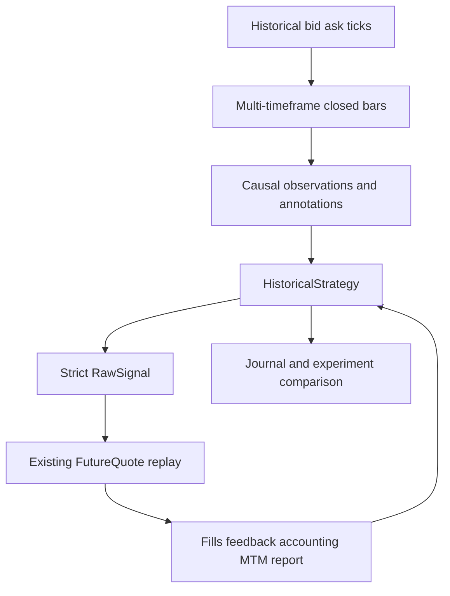
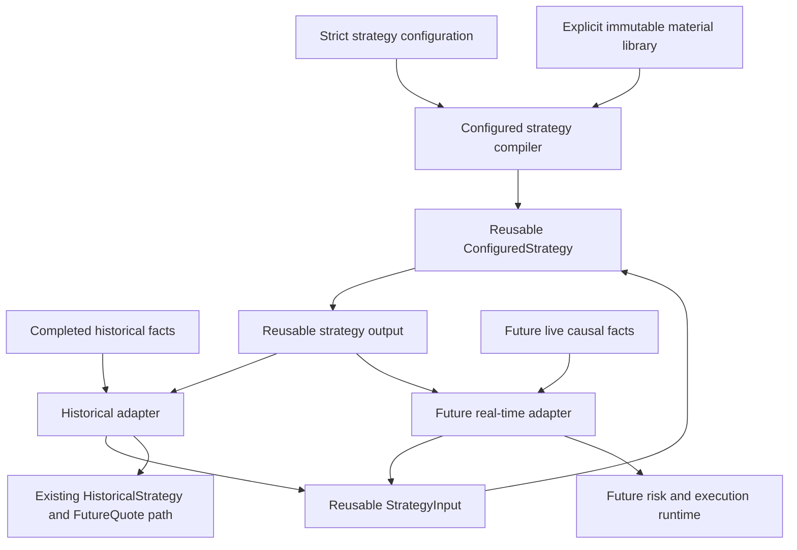

# Roadmap

The implemented foundation supports reusable historical strategy research and backtesting over the existing FutureQuote execution and accounting path, a reusable synchronous configured strategy core, and a historical adapter that connects configured behavior to that replay path, both in process and through the backtest service, which accepts configured strategy documents, management profiles, and parameter searches by request.

> This roadmap does not schedule a live trading platform. The workspace now includes a broker-neutral execution contract library, but no broker adapter, live scheduler, account reconciliation, persistence, or operational recovery.

## Current foundation

```mermaid
flowchart TD
    A[Historical bid ask ticks]
    B[Multi-timeframe closed bars]
    C[Causal observations and annotations]
    D[HistoricalStrategy]
    E[Strict RawSignal]
    F[Existing FutureQuote replay]
    G[Fills feedback accounting MTM report]
    H[Journal and experiment comparison]

    A --> B
    B --> C
    C --> D
    D --> E
    E --> F
    F --> G
    G --> D
    D --> H
```

The historical strategy foundation currently provides validated descriptors and requirements, bounded causal fixed-duration closed bars, complete-boundary analysis, stateful callbacks, generated-signal scheduling, committed execution feedback, bounded decisions, non-economic journals, research-only annotations, and caller-ordered comparison of existing position-level metrics.

Current callers implement `HistoricalStrategy` directly in Rust. A generated fill-bearing action cannot execute on a quote already observed to make that decision.

## Configured strategy implementation

The dependency-light synchronous `qs-strategy` core implements reusable configured behavior outside `qs-backtest`. Its purpose is to avoid requiring a dedicated Rust strategy type for every strategy that can be assembled from reusable materials. Historical backtesting adapts that core rather than owning the configuration compiler, materials, expressions, or state machine.

The implemented historical flow and future live boundary are:

```mermaid
flowchart TD
    A[Strict strategy configuration]
    B[Explicit immutable material library]
    C[Configured strategy compiler]
    D[Reusable ConfiguredStrategy]
    E[Completed historical facts]
    F[Historical adapter]
    G[Reusable StrategyInput]
    H[Reusable strategy output]
    I[Existing HistoricalStrategy and FutureQuote path]
    J[Future live causal facts]
    K[Future real-time adapter]
    L[Future risk and execution runtime]

    A --> C
    B --> C
    C --> D
    E --> F
    F --> G
    G --> D
    D --> H
    H --> F
    F --> I
    J --> K
    K --> G
    H --> K
    K --> L
```

The configured core now provides:

- recursively strict configuration without a schema-version field;
- an explicit immutable library of reusable causal materials;
- compile-time source, named-input schema, reference, type, dependency, per-source lookback, trigger, state, expression, and bound validation;
- bounded typed condition expressions rather than free-form strings;
- ordered independent logical-source updates, total vacant/pending/open trade-slot facts, and deterministic finite-state transitions with atomic state and output;
- typed strict `RawSignal` action templates carried by commands with deterministic correlation IDs, validated action-specific feedback lifecycles, plus generic decision and note templates;
- one reusable configured strategy core independent from historical and real-time runtime ownership;
- neutral conformance coverage and a custom material extension seam;
- no content hash, digest, fingerprint, or content-derived strategy identity.

The historical adapter binds complete logical source specifications to historical series built from ticks or accepted from counted or explicit unknown-count stored bars, projects optional volume and caller-owned typed named inputs, supplies total trade-slot facts including open-position time, excursion, and initial risk, preserves opaque command IDs through ordered effect/disposition feedback and a final feedback boundary, maps generic decisions and notes into historical output, and routes configured entries to management profiles through the same selection raw-signal replay uses, by entry class or run default, rejecting an unrouted class or a stop-ownership conflict before the run. Configured, portfolio, declared-space, and bounded structural searches are available through the existing typed backtest service. Live runtime orchestration and configured-state persistence remain unavailable.

Direct Rust strategies will remain supported for custom algorithms that do not fit the configured model. The framework will not claim that every possible strategy can or should be represented as configuration. No real-time strategy-input adapter or live execution runtime is part of the current implementation goal. The implemented `qs-execution` library is the lower-level request/report contract a future runtime may consume; it is not itself a gateway.

## Unified historical research

The implemented research library provides a semantic-unit-aware named numeric catalog, source-clocked temporal/setup materials, confirmed-structure projection, depth-bounded canonical structural generation, configured and caller-compiled direct factories, typed execution variants, configured/direct heterogeneous portfolio candidates, protected split access, bounded traces/cache/checkpoints with committed outcomes, optional-count and ordered-quote data paths, delayed-availability replay metadata, IANA session resolution, exact enhanced quote statistics, and recipe-rich service search artifacts. Candidate generation and all economics reuse the existing compiler, FutureQuote replay, risk supervision, and evaluation rather than a mask-only or second accounting engine. It reports comparison data and incomplete budgets without choosing a winner.

The service accepts compatible checkpoints, skips committed run ordinals, recombines retained outcomes, maps configured and mixed configured/direct portfolio candidates, selects immutable trusted direct factories by exact revision, publishes resumable complete-run checkpoints after cancellation, and enforces frozen selected rerun and final release/access records with post-test-tuning disclosure. Calendar and ordered-quote projector recipes, cache equality keys, and bounded query policies remain explicit inputs. Production operators still choose resource limits and experiment inputs from their own measured workloads; the framework does not publish an automatic universal preset or profitability claim.

## Broker-neutral execution contract

`qs-execution` now provides a library-only boundary from strict `RawSignal` intent and caller-owned current facts to concrete quantity-bearing requests. It reuses core profile resolution and catalog-aware sizing, supports explicit automatic or entry-approval modes, and translates committed provider observations into the configured fact-plus-terminal feedback contract. Submission acceptance remains distinct from fills, acceptance-unknown work is not automatically retried, partial exposure is retained, and original-entered-size ratio closes are capped at the remaining quantity.

The contract is exercised by a local scripted consumer without credentials, network access, account P&L, or a second fill engine. Preparation records its quote and sizing reference separately from later fills; a provider does not silently resize a submitted market request when execution price differs. Ongoing profile rules require an explicit provider or external runtime owner. Actual broker integrations and live orchestration remain outside the current roadmap.

## Design constraints

Configured strategy execution must preserve the current causal order:

1. settle existing FutureQuote work and commit feedback;
2. update completed historical series and causal analysis;
3. project one immutable reusable strategy input from completed facts;
4. evaluate reusable materials in stable dependency order and select at most one configured transition;
5. atomically commit configured state and output;
6. return ordered correlated commands containing strict `RawSignal` payloads plus generic decisions and notes to the historical adapter;
7. wait for a later eligible quote for fill-bearing work.

Emitting an Entry is not equivalent to a fill. Configured state must use committed execution feedback to distinguish requested, open, rejected, and closed lifecycle states.

Before adapter readiness, causal materials advance but configured transitions, state assignments, decisions, notes, and signals do not. The first ready input evaluates the accumulated material state from unchanged configured state. Source-clocked primitives update only from their declared completed sample, temporal events are bounded pulses or explicit persistent state, and command feedback retains its originating correlation ID. Single and heterogeneous configured portfolios run through one account with explicit instance identity; no allocator silently redistributes requested risk. Legacy comparisons retain their compatibility Missing behavior, while the additive strict predicate path preserves invalidity through Boolean composition and entry requires valid true. Required output cannot be missing, and every declared configured state must be reachable from the initial state or compilation fails.

## What will be reused

The historical adapter reuses:

- historical feed and complete timestamp-batch abstractions;
- `HistoricalStrategy`, `StrategyContext`, and `StrategyFeedback`;
- causal series, observations, annotations, and analyzers;
- strict `RawSignal` validation;
- replay instrument specifications;
- Entry profile selection and resolution, shared with raw-signal replay;
- FutureQuote slippage, pending, stop, target, scale-in, and close behavior;
- account-currency sizing and conversion;
- fills, lifecycle, MTM, drawdown, and `BacktestResult`;
- decision, journal, research annotation, and experiment output.

## Neutral acceptance direction

Public conformance should use neutral examples such as:

- a no-op configured strategy;
- a moving-average crossover configuration;
- a volatility-aware lifecycle configuration;
- feedback-driven entry, break-even, partial-close, and exit behavior;
- one custom material reused by more than one configuration;
- economic parity with equivalent direct `RawSignal` replay.

Concrete private strategy configurations may be added later when there is a real research need. They are not required to introduce named strategy types into the reusable framework.

## What is not on the active roadmap

- dedicated named strategy implementations as a framework requirement;
- a universal or free-form scripting language;
- global mutable component registries;
- dynamic plugins or behavior discovery;
- deployment compilers or content-addressed strategy artifacts;
- strategy code, custom materials, or analyzers received over RPC; a remotely submitted strategy document may use only materials registered in the server build;
- ingestion-to-trading bridges;
- multi-strategy portfolio allocation or optimization; portfolio supervision approves or rejects each instance's requests but never allocates capital between strategies;
- paper or live execution gateways beyond the implemented provider-neutral request/report library;
- restart-safe configured or live strategy state;
- broker and exchange order adapters;
- cryptocurrency economics beyond the current rejection guard;
- model training and live inference;
- Discord or screenshot integrations.

An explicit immutable run-local material library and an in-process configured-strategy compiler are compatible with these boundaries. They must not grow into a global plugin or deployment platform.

## Completion status

The implementation now allows a developer to:

1. define a nontrivial causal strategy through strict configuration and reusable materials;
2. compile it in a reusable strategy core outside `qs-backtest` and reject invalid graphs, types, references, bounds, and transitions before execution;
3. consume adapter-supplied causal context and committed execution feedback without importing historical runtime types;
4. emit validated ordered commands with deterministic correlation IDs, strict `RawSignal` payloads, and bounded generic decisions and notes;
5. adapt the same configured behavior to historical replay through the existing FutureQuote engine without another economic path;
6. reproduce equivalent direct-signal economic results;
7. reuse one custom material across several configurations;
8. preserve a boundary that a future real-time adapter can use without depending on `qs-backtest`;
9. continue implementing direct Rust strategies without framework regression;
10. prepare and validate broker-neutral execution requests, approval state, and report feedback locally without a broker or live scheduler;
11. run counted/unknown-count, direct, variant, mixed, temporal, cache, cancellation-resume, and protected-final research workflows from one neutral executable example.

The historical adapter and the configured-strategy objective are complete for the approved in-process scope, including aligned-EOD materialized/streaming full-result parity and full workspace validation. The backtest service now also runs configured strategy documents, portfolios of configured instances under optional portfolio policies, and parameter searches received at runtime, reusing the same adapter, portfolio replay, and research batch. See [Backtesting](backtesting.md) for current replay behavior and limitations.
